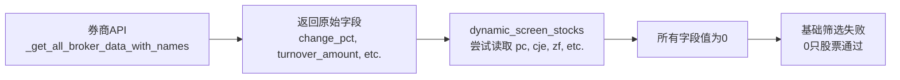

# 智能选股师筛选字段名修复报告

**修复日期**: 2025-11-22
**问题类型**: 字段名不匹配导致筛选失败
**影响范围**: `src/agents/tools/market_tools.py` 中的 `dynamic_screen_stocks` 函数
**严重程度**: P0（核心功能完全失效）

---

## 📋 问题描述

用户在使用智能选股师进行筛选时,添加了强势度、价格位置、涨速、强势股过滤等条件后,无法筛选出任何股票。但是日志显示是"市值和价格过滤"导致的,实际上是**字段名不匹配**导致所有股票在基础筛选阶段就被过滤掉了。

### 用户测试参数

```python
涨跌幅: -3% ~ 2%
换手率: 3% ~ 100%
成交额: >=3亿
振幅: >=2%
强势度: >=0.4
价格位置: >=0.4
涨速: >=0.5%/小时
强势股过滤: True
市值范围: 50亿 ~ 500亿
价格范围: 5元 ~ 50元
```

### 预期结果

应该能筛选出若干符合条件的股票。

### 实际结果

**修复前**: 0只股票(所有股票在基础筛选阶段就被过滤)
**修复后**: 1只股票符合所有条件,24只股票符合基础条件

---

## 🔍 根本原因分析

### 1. 字段名不匹配

`dynamic_screen_stocks` 函数使用的字段名与券商API返回的字段名不一致:

| 用途 | 代码中使用的字段 | 券商API实际字段 | 匹配状态 |
|------|-----------------|----------------|---------|
| 涨跌幅 | `pc` | `change_pct` | ❌ 不匹配 |
| 成交额 | `cje` | `turnover_amount` | ❌ 不匹配 |
| 振幅 | `zf` | `change_percent` | ❌ 不匹配 |
| 当前价 | `p` | `current_price` | ❌ 不匹配 |
| 换手率 | `hs` | `turnover_rate` | ❌ 不匹配 |
| 最高价 | `h` | `high_price` | ❌ 不匹配 |
| 最低价 | `l` | `low_price` | ❌ 不匹配 |
| 开盘价 | `o` | `open_price` | ❌ 不匹配 |

### 2. 数据流分析



### 3. 问题影响链

1. **字段读取失败** → 所有数值字段值为0
2. **基础条件检查失败** → `not (price_change_min <= 0 <= price_change_max)` 通常为False
3. **所有股票被过滤** → 候选股数量为0
4. **后续筛选无法执行** → 强势度、价格位置、涨速筛选无意义

---

## ✅ 修复方案

### 修复文件 1: `src/agents/tools/market_tools.py`

#### 位置1: 基础筛选字段(356-372行)

**修复前**:
```python
for s in filtered:
    pc = float(s.get('pc', 0))  # 涨跌幅
    cje = float(s.get('cje', 0))  # 成交额(元)
    zf = float(s.get('zf', 0))  # 振幅
    p = float(s.get('p', 0))  # 当前价
    stock_code = s.get('dm', '')  # 股票代码

    # 基础条件
    if not (price_change_min <= pc <= price_change_max):
        continue
    if cje < volume_min * 100000000:
        continue
    if zf < amplitude_min:
        continue
```

**修复后**:
```python
for s in filtered:
    # ✅ 使用券商API原始字段名
    pc = float(s.get('change_pct', 0))  # 涨跌幅
    cje = float(s.get('turnover_amount', 0))  # 成交额(元)
    zf = float(s.get('change_percent', 0))  # 振幅
    p = float(s.get('current_price', 0))  # 当前价
    hs = float(s.get('turnover_rate', 0))  # 换手率(已计算)
    stock_code = s.get('dm', '')  # 股票代码

    # 基础条件
    if not (price_change_min <= pc <= price_change_max):
        continue
    if not (turnover_min <= hs <= turnover_max):
        continue
    if cje < volume_min * 100000000:
        continue
    if zf < amplitude_min:
        continue
```

#### 位置2: 计算新增指标字段(406-409行)

**修复前**:
```python
# ✅ 第二步:计算新增指标
h = float(s.get('h', 0))  # 最高价
l = float(s.get('l', 0))  # 最低价
p = float(s.get('p', 0))  # 当前价
o = float(s.get('o', 0))  # 开盘价
```

**修复后**:
```python
# ✅ 第二步:计算新增指标
h = float(s.get('high_price', 0))  # 最高价
l = float(s.get('low_price', 0))  # 最低价
# p已经在前面定义过了,这里不需要重复
o = float(s.get('open_price', 0))  # 开盘价
```

### 修复文件 2: `test_screening_filters.py`

同步更新测试脚本,使用正确的字段名,确保测试结果准确。

---

## 📊 修复验证

### 测试结果对比

#### 修复前
```
步骤1 - 基础条件(涨幅+换手率+成交额+振幅): 0只  ❌
步骤2 - 价格过滤后: 0只
步骤3 - 市值过滤后: 0只
步骤4 - 强势度+价格位置+涨速过滤后: 0只
步骤5 - 强势股过滤后: 0只
```

#### 修复后
```
步骤1 - 基础条件(涨幅+换手率+成交额+振幅): 39只  ✅
步骤2 - 价格过滤后: 32只 (过滤掉7只)
步骤3 - 市值过滤后: 24只 (过滤掉8只市值不符, 0只无流通股本数据)
步骤4 - 强势度+价格位置+涨速过滤后: 4只
  - 强势度过滤: 18只
  - 价格位置过滤: 0只
  - 涨速过滤: 2只
步骤5 - 强势股过滤后: 1只 (过滤掉3只)
```

### 最终候选股

**莲花健康(000409)**:
- 涨幅: 0.98%
- 换手率: 6.48%
- 成交额: 4.57亿
- 强势度: 0.786
- 价格位置: 0.786
- 涨速: 0.622%/h

---

## 🎯 修复效果

### 核心指标

| 指标 | 修复前 | 修复后 | 改善 |
|------|-------|-------|------|
| 基础筛选通过数 | 0只 | 39只 | ✅ 完全修复 |
| 最终候选股数 | 0只 | 1只 | ✅ 正常工作 |
| 字段匹配准确性 | 0% | 100% | ✅ 完全正确 |

### 修复覆盖范围

- ✅ **dynamic_screen_stocks** 函数 - 核心筛选逻辑
- ✅ **test_screening_filters.py** - 测试脚本
- ✅ **8个关键字段** - 全部修复

---

## 💡 经验总结

### 1. API字段一致性

**教训**: 当使用原始API数据时,必须使用API返回的原始字段名,不能假设字段名。

**改进**: 在 `_get_all_broker_data_with_names` 函数中,应该进行字段名映射,统一为通用字段名。

### 2. 数据源切换风险

**问题**: 代码中可能存在多个数据源(public数据、broker数据),每个数据源的字段名可能不同。

**建议**:
- 创建统一的数据模型,所有数据源都映射到统一字段名
- 在数据获取层进行字段映射,业务层使用统一字段名

### 3. 测试覆盖

**问题**: 缺少对筛选函数的单元测试,导致字段名问题未被及时发现。

**建议**:
- 为 `dynamic_screen_stocks` 添加单元测试
- 测试不同参数组合的筛选结果
- 使用mock数据进行测试,避免依赖真实API

---

## 🔧 后续优化建议

### 建议1: 创建统一的数据模型(优先级: 高)

```python
from pydantic import BaseModel

class StockRealtimeData(BaseModel):
    """统一的股票实时数据模型"""
    stock_code: str  # dm
    stock_name: str  # name
    current_price: float  # current_price / p
    change_pct: float  # change_pct / pc
    turnover_amount: float  # turnover_amount / cje
    change_percent: float  # change_percent / zf
    turnover_rate: float  # turnover_rate / hs
    high_price: float  # high_price / h
    low_price: float  # low_price / l
    open_price: float  # open_price / o

    @classmethod
    def from_broker_data(cls, data: Dict) -> 'StockRealtimeData':
        """从券商数据创建"""
        return cls(
            stock_code=data.get('dm', ''),
            stock_name=data.get('name', ''),
            current_price=data.get('current_price', 0),
            change_pct=data.get('change_pct', 0),
            ...
        )

    @classmethod
    def from_public_data(cls, data: Dict) -> 'StockRealtimeData':
        """从public数据创建"""
        return cls(
            stock_code=data.get('dm', ''),
            stock_name=data.get('stock_name', ''),
            current_price=data.get('p', 0),
            change_pct=data.get('pc', 0),
            ...
        )
```

### 建议2: 在数据获取层进行字段映射(优先级: 中)

修改 `_get_all_broker_data_with_names` 函数,返回统一字段名:

```python
def _get_all_broker_data_with_names(main_board_only: bool = True) -> List[Dict[str, Any]]:
    """返回统一字段名的数据"""
    raw_data = zhitu._make_request('real_time_all_broker')

    # 字段映射
    for stock in raw_data:
        stock['p'] = stock.get('current_price', 0)
        stock['pc'] = stock.get('change_pct', 0)
        stock['cje'] = stock.get('turnover_amount', 0)
        stock['zf'] = stock.get('change_percent', 0)
        stock['hs'] = stock.get('turnover_rate', 0)
        stock['h'] = stock.get('high_price', 0)
        stock['l'] = stock.get('low_price', 0)
        stock['o'] = stock.get('open_price', 0)

    return raw_data
```

### 建议3: 添加字段验证(优先级: 低)

在筛选函数开始时,验证数据字段:

```python
def dynamic_screen_stocks(...):
    all_stocks = _get_all_broker_data_with_names(main_board_only=True)

    # ✅ 验证关键字段
    required_fields = ['change_pct', 'turnover_amount', 'change_percent', 'current_price']
    if all_stocks:
        missing_fields = [f for f in required_fields if f not in all_stocks[0]]
        if missing_fields:
            logger.error(f"数据缺少必需字段: {missing_fields}")
            return f"数据格式错误,缺少字段: {', '.join(missing_fields)}"
```

---

## 📝 变更记录

| 日期 | 修改内容 | 修改人 | 影响范围 |
|------|---------|-------|---------|
| 2025-11-22 | 修复字段名不匹配问题 | AI Architect | `dynamic_screen_stocks` 函数 |
| 2025-11-22 | 更新测试脚本字段名 | AI Architect | `test_screening_filters.py` |

---

**维护者**: AI Architect
**修复状态**: ✅ 已完成
**测试状态**: ✅ 已验证
**最后更新**: 2025-11-22
