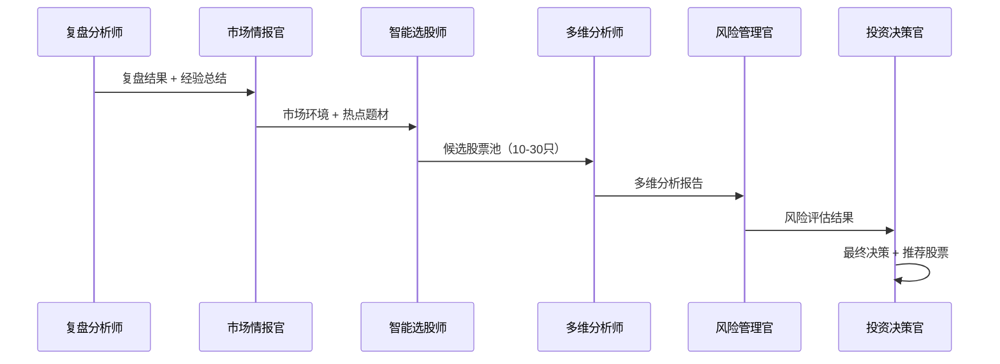
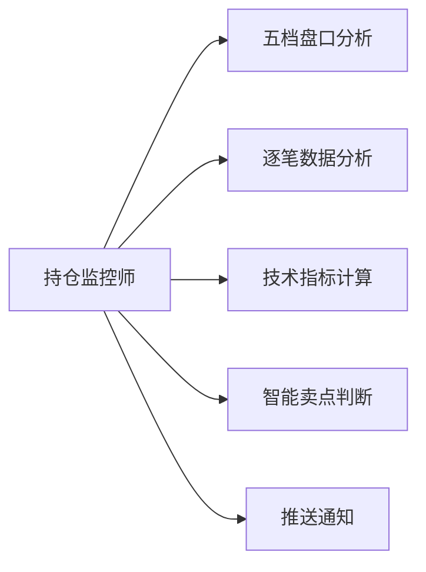
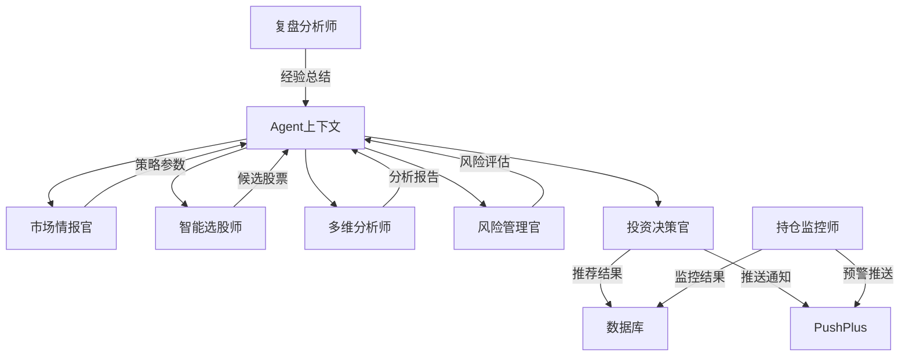

[根目录](../../CLAUDE.md) > [src](../) > **agents**

# Agents 模块 - AI智能体层

## 📋 模块职责

定义和管理所有 AI 智能体（Agent），实现多智能体协作的股票推荐系统。包含 7 个专业 Agent 和 48+ 个工具函数，支持完整的股票分析与决策流程。

## 🤖 核心 Agent 架构

### 智能推荐系统（6个Agent协作）



### 持仓监控系统（1个Agent）



## 🧠 7 个 Agent 详解

### 1. 复盘分析师 (Performance Analyst)

**职责**：复盘昨日推荐 + 策略表现分析 + 经验总结

**专业背景**：
- 统计学博士（北京大学光华管理学院）
- FRM持证人（金融风险管理师）
- 10年+ 量化私募绩效分析经验

**核心能力**：
- 绩效归因分析：识别策略成功/失败根本原因
- 策略优化：基于历史数据优化参数
- 风险识别：提前识别策略失效信号
- 经验总结：提炼可复制的成功模式

**工作流程（6步法）**：
1. 分析最近一个交易日推荐表现
2. 分析今日推荐当前表现
3. 分析所有历史策略胜率
4. 成功案例提炼
5. 失败案例分析
6. 深度经验总结（为市场情报官提供决策依据）

**核心工具**：
- `analyze_recommendation_performance(days=-1)` - 推荐绩效分析
- `query_strategy_performance()` - 策略表现查询
- `save_agent_context()` - 保存经验总结

### 2. 市场情报官 (Market Intelligence)

**职责**：市场环境分析 + 新闻热点 + 涨停板分析

**专业背景**：
- 金融学硕士（清华大学五道口金融学院）
- 10年+ 市场研究经验
- 前券商研究所所长

**核心能力**：
- 市场阶段识别：牛市/震荡/熊市/反弹/调整
- 新闻情绪分析：识别市场热点和风险
- 涨停板规律分析：识别板块轮动
- 策略推荐：根据市场环境推荐最佳策略

**工作流程（5步法）**：
1. 识别当前市场阶段
2. 分析市场新闻和热点
3. 分析涨停股票规律
4. 推荐今日筛选策略
5. 保存策略上下文

**核心工具**：
- `identify_market_phase()` - 市场阶段识别
- `search_market_news()` - 新闻搜索
- `dynamic_screen_stocks()` - 动态筛选（涨停股池）
- `save_agent_context()` - 保存策略上下文

### 3. 智能选股师 (Stock Selector)

**职责**：动态筛选候选股 + 质量评估 + 涨停股过滤

**专业背景**：
- 计算机科学博士 + 金融工程硕士
- CFA持证人
- 10年+ 量化选股经验

**核心能力**：
- 动态筛选：根据市场环境自适应调整筛选条件
- 质量评估：多维度评估股票质量
- 涨停股过滤：识别涨停板套路
- 数据整合：整合5个数据源

**工作流程（7步法）**：
1. 从Agent上下文获取策略参数
2. 过滤最近卖出的股票（冷却期）
3. 执行动态筛选（10-200只）
4. 质量评估（流通市值、社区情绪）
5. 并行获取基础数据
6. 最终筛选（10-30只）
7. 保存候选股票上下文

**核心工具**：
- `load_agent_context()` - 加载策略上下文
- `query_recently_sold_positions()` - 查询最近卖出股票
- `dynamic_screen_stocks()` - 动态筛选
- `get_stock_community_comments()` - 社区情绪分析
- `analyze_stocks_parallel()` - 并行分析
- `save_agent_context()` - 保存候选股票

### 4. 多维分析师 (Multi-Dimensional Analyst)

**职责**：5维深度分析（技术+资金+基本面+新闻+社区情绪）

**专业背景**：
- 金融工程博士
- CFA + FRM 双证
- 15年+ 股票分析经验

**核心能力**：
- 5维并行分析：技术、资金、基本面、新闻、社区情绪
- 深度指标计算：MACD、KDJ、RSI、资金流向
- 新闻情绪分析：识别利好/利空
- 社区情绪挖掘：东方财富、雪球、淘股吧

**工作流程（分批分析策略）**：
1. 从上下文加载候选股票（10-30只）
2. 分批分析（每批3-5只，防止超时）
3. 5维深度分析：
   - 技术面：MACD、KDJ、RSI、支撑/压力位
   - 资金面：主力资金流向、大单分析
   - 基本面：PE、PB、ROE、营收增长
   - 新闻面：近3天新闻情绪
   - 社区情绪：东方财富+雪球+淘股吧
4. 保存分析结果

**核心工具**：
- `load_agent_context()` - 加载候选股票
- `get_technical_indicators()` - 技术指标
- `get_fund_flow()` - 资金流向
- `get_fundamental_data()` - 基本面数据
- `search_stock_news()` - 新闻搜索
- `get_stock_community_comments()` - 社区情绪
- `save_agent_context()` - 保存分析结果

### 5. 风险管理官 (Risk Manager)

**职责**：风险评估 + 持仓管理 + 止损止盈

**专业背景**：
- 风险管理博士
- FRM持证人
- 12年+ 风险管理经验

**核心能力**：
- 风险评估：技术风险、基本面风险、市场风险
- 仓位控制：最大仓位、单股仓位限制
- 止损止盈：动态止损、移动止盈
- 组合风险：计算投资组合整体风险

**工作流程（5步法）**：
1. 从上下文加载分析结果
2. 逐只评估风险（技术+基本面+市场）
3. 识别高风险股票（剔除）
4. 计算投资组合风险
5. 保存风险评估结果

**核心工具**：
- `load_agent_context()` - 加载分析结果
- `query_current_positions()` - 查询当前持仓
- `calculate_portfolio_risk()` - 计算组合风险
- `save_agent_context()` - 保存风险评估

### 6. 投资决策官 (Investment Decision Officer)

**职责**：最终决策 + 仓位分配 + 推送通知

**专业背景**：
- MBA（沃顿商学院）
- CFA持证人
- 20年+ 投资管理经验

**核心能力**：
- 综合决策：整合所有分析结果
- 仓位分配：智能分配资金
- 买入时机：明日开盘/立即买入/等待回调
- 操作建议：考虑当前持仓给出操作建议

**工作流程（7步法）**：
1. 从上下文加载所有分析结果
2. 过滤最近卖出的股票（再次确认）
3. 查询当前持仓
4. 计算推荐数量（根据总资产）
5. 综合评分 + Top N 选择
6. 生成操作建议（考虑持仓）
7. 保存推荐 + 推送通知

**核心工具**：
- `load_agent_context()` - 加载所有上下文
- `query_recently_sold_positions()` - 查询最近卖出
- `query_current_positions()` - 查询当前持仓
- `calculate_recommended_count()` - 计算推荐数量
- `save_recommendations_to_db()` - 保存推荐
- `send_stock_recommendation()` - 推送通知

### 7. 持仓监控师 (Position Monitor)

**职责**：实时监控持仓 + 智能卖点 + 风险预警

**专业背景**：
- 金融工程硕士
- CFA持证人
- 10年+ 交易经验

**核心能力**：
- 实时监控：5分钟级别持仓监控
- 智能卖点：五档盘口+逐笔数据+技术指标
- 风险预警：移动止盈、止损预警
- 推送通知：实时推送卖点建议

**工作流程（3个Task）**：
1. **Task 1**：监控所有持仓
   - 查询所有holding状态持仓
   - 批量获取实时价格
   - 识别需要分析的持仓
2. **Task 2**：深度分析每只持仓
   - 五档盘口分析
   - 当天逐笔数据分析（仅当天，不用历史数据）
   - 技术指标分析
   - 生成卖点建议
3. **Task 3**：推送通知
   - 强烈建议卖出 → 立即推送
   - 建议卖出 → 推送
   - 建议持有 → 不推送

**核心工具**：
- `query_current_positions()` - 查询持仓
- `get_realtime_prices()` - 批量实时价格
- `get_five_level_quotes()` - 五档盘口
- `get_today_tick_analysis()` - 当天逐笔数据分析
- `get_technical_indicators()` - 技术指标
- `update_trailing_stop_data()` - 更新移动止盈
- `send_alert_notification()` - 推送预警

## 🔧 48+ 核心工具

### 数据库工具（10个）
```python
- query_strategy_performance          # 策略表现查询
- analyze_recommendation_performance  # 推荐绩效分析
- query_total_assets                  # 查询总资产
- calculate_recommended_count         # 计算推荐数量
- save_recommendations_to_db          # 保存推荐
- query_current_positions             # 查询当前持仓
- query_recently_sold_positions       # 查询最近卖出股票
- calculate_portfolio_risk            # 计算组合风险
- update_trailing_stop_data           # 更新移动止盈数据
- save_agent_context, load_agent_context, clear_agent_context  # Agent上下文管理
```

### 市场数据工具（10个）
```python
- get_market_sentiment                # 获取市场情绪
- identify_market_phase               # 市场阶段识别
- dynamic_screen_stocks               # 动态筛选股票
- get_technical_indicators            # 技术指标
- get_fund_flow                       # 资金流向
- get_fundamental_data                # 基本面数据
- analyze_stocks_parallel             # 并行分析
- get_realtime_prices                 # 批量实时价格
- get_five_level_quotes               # 五档盘口
```

### 新闻分析工具（3个）
```python
- search_market_news                  # 市场新闻搜索
- search_stock_news                   # 个股新闻搜索
- analyze_news_sentiment              # 新闻情绪分析
```

### 社区情绪工具（4个）
```python
- get_stock_community_comments        # 综合社区评论
- get_xueqiu_comments                 # 雪球评论
- get_eastmoney_comments              # 东方财富评论
- get_taoguba_comments                # 淘股吧评论
```

### 逐笔数据工具（2个）
```python
- get_smart_tick_analysis             # 智能逐笔数据分析（优先当天，无数据则历史）
- get_today_tick_analysis             # 当天逐笔数据分析（仅当天）
```

### 推送通知工具（3个）
```python
- send_push_notification              # 通用推送
- send_stock_recommendation           # 推荐推送
- send_alert_notification             # 预警推送
```

## 🚀 入口与启动

### 创建所有Agent

```python
from src.agents.smart_agents import create_all_smart_agents

# 创建所有Agent
agents = create_all_smart_agents()

# 访问特定Agent
performance_analyst = agents['performance_analyst']
market_intelligence = agents['market_intelligence']
stock_selector = agents['stock_selector']
multi_dimensional_analyst = agents['multi_dimensional_analyst']
risk_manager = agents['risk_manager']
investment_decision_officer = agents['investment_decision_officer']
position_monitor = agents['position_monitor']
```

### 创建单个Agent

```python
from src.agents.smart_agents import (
    create_performance_analyst,
    create_market_intelligence,
    create_stock_selector,
    create_multi_dimensional_analyst,
    create_risk_manager,
    create_investment_decision_officer,
    create_position_monitor
)

# 创建复盘分析师
performance_analyst = create_performance_analyst()

# 创建持仓监控师
position_monitor = create_position_monitor()
```

## 🔗 对外接口

### Agent 工具导入

```python
from src.agents.tools import (
    # 数据库工具
    query_strategy_performance,
    analyze_recommendation_performance,
    save_recommendations_to_db,
    query_current_positions,
    # 市场数据工具
    get_market_sentiment,
    identify_market_phase,
    dynamic_screen_stocks,
    get_technical_indicators,
    # 新闻工具
    search_market_news,
    search_stock_news,
    # 社区情绪工具
    get_stock_community_comments,
    # 推送工具
    send_stock_recommendation,
    send_alert_notification,
    # Agent上下文
    save_agent_context,
    load_agent_context
)
```

## 🔧 关键依赖与配置

### 核心依赖

```python
# AI框架
crewai>=0.95.0
langchain>=0.3.0
pydantic>=2.5.0

# LLM
openai>=1.0.0  # DeepSeek API

# 数据处理
pandas>=2.2.0
numpy>=2.0.0
```

### LLM 配置

```python
# src/config/llm_config.py
from langchain_openai import ChatOpenAI

# 决策型LLM（高推理能力）
decision_llm = ChatOpenAI(
    model="deepseek-chat",
    temperature=0.7,
    max_tokens=8000
)

# 分析型LLM（平衡）
analysis_llm = ChatOpenAI(
    model="deepseek-chat",
    temperature=0.3,
    max_tokens=4000
)

# 创意型LLM（高创造力）
creative_llm = ChatOpenAI(
    model="deepseek-chat",
    temperature=1.0,
    max_tokens=8000
)
```

## 📊 数据流与关系

### Agent 协作流程



### Agent上下文传递

所有Agent通过 `agent_context` 表共享上下文数据：

```python
# 保存上下文
save_agent_context(
    context_type='strategy_params',
    context_data={
        'strategy_name': '龙头战法',
        'recommended_count': 5
    }
)

# 加载上下文
context = load_agent_context('strategy_params')
```

## 🧪 测试与质量

### Agent 测试

```python
# tests/test_agents.py
def test_performance_analyst():
    """测试复盘分析师"""
    agent = create_performance_analyst()
    assert agent.role == '复盘分析师 (Performance Analyst)'

def test_agent_tools():
    """测试Agent工具"""
    result = analyze_recommendation_performance(days=-1)
    assert 'recommend_stats' in result
```

### 工具测试

```python
# tests/test_agent_tools.py
def test_dynamic_screen_stocks():
    """测试动态筛选"""
    result = dynamic_screen_stocks(
        strategy_params={'pool_type': 'limit_up'},
        session_id='test'
    )
    assert len(result) > 0

def test_agent_context():
    """测试Agent上下文"""
    save_agent_context('test', {'data': 'test'})
    context = load_agent_context('test')
    assert context['data'] == 'test'
```

## ⚠️ 常见问题 (FAQ)

### Q1: 如何添加新的Agent工具？
A1: 在 `src/agents/tools/` 目录下创建新的工具文件，然后在 `__init__.py` 中导出。工具函数需要使用 `@tool` 装饰器。

### Q2: Agent如何共享数据？
A2: 使用 Agent上下文机制（`agent_context` 表），通过 `save_agent_context()` 和 `load_agent_context()` 函数传递数据。

### Q3: 如何调试Agent执行过程？
A3: 使用Crew的流式输出功能，或查看 `agent_decision_logs` 表的详细日志。

### Q4: 如何优化Agent性能？
A4: 1) 使用并行分析减少耗时；2) 合理设置max_tokens；3) 使用缓存机制；4) 分批处理大量数据。

### Q5: 如何处理Agent错误？
A5: Agent工具都包含错误处理机制，会返回错误信息而不会中断整个流程。查看日志文件获取详细错误。

## 📁 相关文件清单

### 核心文件
- `src/agents/smart_agents.py` (730行) - 所有Agent定义
- `src/agents/tools/__init__.py` - 工具导出
- `src/agents/tools/database_tools.py` - 数据库工具
- `src/agents/tools/market_tools.py` - 市场数据工具
- `src/agents/tools/news_tools.py` - 新闻工具
- `src/agents/tools/community_sentiment_tools.py` - 社区情绪工具
- `src/agents/tools/notification_tools.py` - 推送工具
- `src/agents/tools/position_tools.py` - 持仓工具
- `src/agents/tools/context_tools.py` - 上下文工具
- `src/agents/tools/tick_data_tools.py` - 逐笔数据工具

### 配置文件
- `src/config/llm_config.py` - LLM配置

### 测试文件
- `tests/test_agents.py` - Agent测试
- `tests/test_agent_tools.py` - 工具测试

---

**维护者**: AI Architect
**模块状态**: ✅ 7个Agent完整实现，48+工具函数
**最后更新**: 2025-11-22 14:32:44
**Agent数量**: 7个（6个推荐 + 1个监控）
**工具数量**: 48+个专业工具
**依赖模块**: [config](../config/CLAUDE.md), [database](../database/CLAUDE.md), [tools](../tools/CLAUDE.md)
