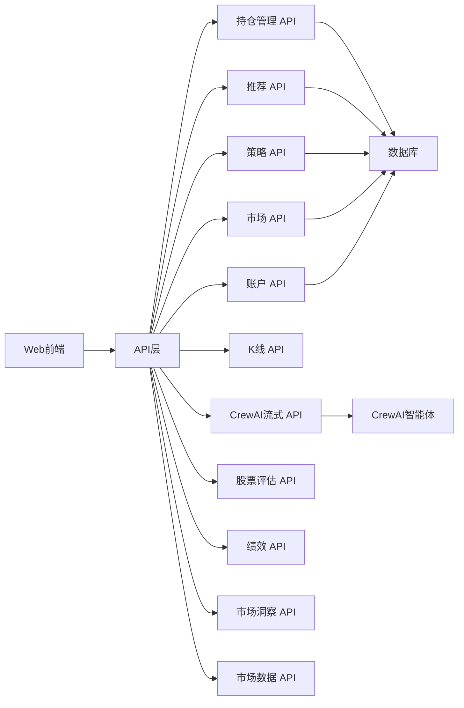
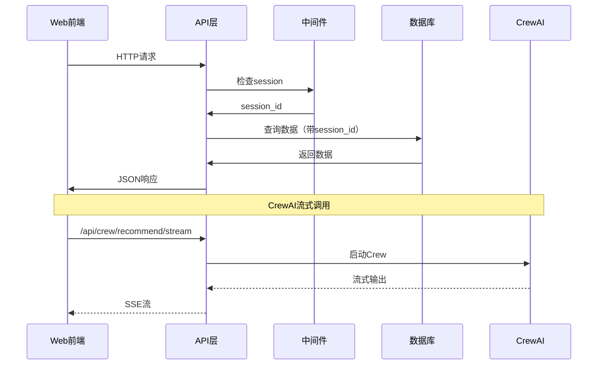

[根目录](../../CLAUDE.md) > [src](../) > **api**

# API 模块 - REST API接口层

## 📋 模块职责

提供完整的 REST API 接口，支持 Web 前端和外部系统调用。包含 11 个蓝图（Blueprint），18+ 个端点，支持多用户隔离、流式输出、实时数据等功能。

## 🌐 API 架构

### 11 个核心蓝图



## 📊 API 蓝图详解

### 1. 持仓管理 API (`position_api.py`)

**路由前缀**: `/api/positions`

**核心端点**:

```python
GET  /api/positions/all              # 获取所有持仓（包括已卖出）
GET  /api/positions/holding          # 获取当前持仓
POST /api/positions/buy              # 买入股票
POST /api/positions/sell             # 卖出股票
POST /api/positions/add-position     # 补仓
GET  /api/positions/sync-from-broker # 同步券商持仓（实盘用户）
```

**功能特性**:
- ✅ 支持手动买入/卖出（模拟盘）
- ✅ 支持券商持仓同步（实盘用户）
- ✅ 实时盈亏计算
- ✅ T+1约束检查
- ✅ 多用户数据隔离

**请求示例**:
```bash
# 买入股票
POST /api/positions/buy
{
  "stock_code": "000001",
  "stock_name": "平安银行",
  "buy_price": 15.20,
  "quantity": 1000,
  "strategy_used": "龙头战法"
}

# 卖出股票
POST /api/positions/sell
{
  "position_id": 123,
  "sell_price": 16.50,
  "sell_reason": "止盈"
}
```

### 2. 推荐 API (`recommendation_api.py`)

**路由前缀**: `/api/recommendations`

**核心端点**:

```python
GET /api/recommendations/recent      # 获取最近3天推荐
GET /api/recommendations/latest      # 获取最新一次推荐
```

**功能特性**:
- ✅ 返回AI推荐的股票列表
- ✅ 包含评分、决策、风险等级
- ✅ 支持按时间范围过滤
- ✅ 多用户数据隔离

**响应示例**:
```json
{
  "success": true,
  "data": {
    "recommendations": [
      {
        "stock_code": "000001",
        "stock_name": "平安银行",
        "final_score": 88.5,
        "ceo_decision": "STRONG_BUY",
        "recommend_price": 15.20,
        "recommend_time": "2025-11-22 09:30:00",
        "strategy_name": "龙头战法"
      }
    ],
    "total": 5
  }
}
```

### 3. 策略 API (`strategy_api.py`)

**路由前缀**: `/api/strategies`

**核心端点**:

```python
GET /api/strategies/performance      # 获取策略表现
GET /api/strategies/weights          # 获取策略权重
```

**功能特性**:
- ✅ 查询所有策略的胜率和收益
- ✅ 动态策略权重
- ✅ 策略表现统计

### 4. 市场 API (`market_api.py`)

**路由前缀**: `/api/market`

**核心端点**:

```python
GET /api/market/sentiment            # 获取市场情绪
GET /api/market/hot-stocks           # 获取热门股票
```

**功能特性**:
- ✅ 市场情绪分析
- ✅ 涨停/跌停家数
- ✅ 热点题材识别

### 5. 账户 API (`account_api.py`)

**路由前缀**: `/api/account`

**核心端点**:

```python
GET  /api/account/balance            # 获取账户余额
POST /api/account/deposit            # 追加资金
POST /api/account/withdraw           # 提取资金
GET  /api/account/transactions       # 获取交易记录
GET  /api/account/summary            # 获取账户汇总
```

**功能特性**:
- ✅ 资金管理（追加/提取）
- ✅ 交易记录查询
- ✅ 账户汇总统计
- ✅ 多用户数据隔离

**请求示例**:
```bash
# 追加资金
POST /api/account/deposit
{
  "amount": 10000,
  "note": "追加本金"
}

# 提取资金
POST /api/account/withdraw
{
  "amount": 5000,
  "note": "提取盈利"
}
```

### 6. K线 API (`kline_api.py`)

**路由前缀**: `/api/kline`

**核心端点**:

```python
GET /api/kline/<stock_code>          # 获取K线数据
```

**功能特性**:
- ✅ 5分钟级别K线
- ✅ 标记推荐点和买入点
- ✅ 智能缓存（5分钟）
- ✅ ECharts格式输出

**响应示例**:
```json
{
  "success": true,
  "data": {
    "stock_code": "000001",
    "stock_name": "平安银行",
    "klines": [
      {
        "time": "2025-11-22 09:30:00",
        "open": 15.10,
        "high": 15.30,
        "low": 15.05,
        "close": 15.20,
        "volume": 1000000
      }
    ],
    "markers": {
      "recommendations": [
        {"time": "2025-11-22 09:30:00", "price": 15.20, "label": "AI推荐"}
      ],
      "purchases": [
        {"time": "2025-11-22 09:35:00", "price": 15.25, "label": "买入"}
      ]
    }
  }
}
```

### 7. CrewAI 流式 API (`crew_stream_api.py`)

**路由前缀**: `/api/crew`

**核心端点**:

```python
GET /api/crew/recommend/stream       # 流式执行AI推荐
```

**功能特性**:
- ✅ SSE（Server-Sent Events）流式输出
- ✅ 实时展示Agent执行过程
- ✅ 支持前端流式渲染
- ✅ 多用户隔离

**响应格式（SSE）**:
```
data: {"type": "agent_start", "agent": "复盘分析师", "message": "开始复盘分析..."}
data: {"type": "agent_output", "agent": "复盘分析师", "message": "昨日推荐胜率：75%"}
data: {"type": "agent_complete", "agent": "复盘分析师", "message": "复盘分析完成"}
data: {"type": "crew_complete", "message": "AI推荐完成", "result": {...}}
```

**前端使用示例**:
```javascript
const eventSource = new EventSource('/api/crew/recommend/stream');
eventSource.onmessage = (event) => {
  const data = JSON.parse(event.data);
  console.log(data.type, data.message);
};
```

### 8. 股票评估 API (`stock_evaluation_api.py`)

**路由前缀**: `/api/stock-evaluation`

**核心端点**:

```python
POST /api/stock-evaluation/evaluate  # 评估指定股票
```

**功能特性**:
- ✅ 5维深度分析（技术+资金+基本面+新闻+社区）
- ✅ 返回详细评估报告
- ✅ 支持批量评估

**请求示例**:
```bash
POST /api/stock-evaluation/evaluate
{
  "stock_codes": ["000001", "600000"],
  "analysis_depth": "deep"
}
```

### 9. 绩效 API (`performance_api.py`)

**路由前缀**: `/api/performance`

**核心端点**:

```python
GET /api/performance/summary         # 获取绩效汇总
GET /api/performance/daily           # 获取每日绩效
GET /api/performance/monthly         # 获取月度绩效
```

**功能特性**:
- ✅ 推荐胜率统计
- ✅ 交易胜率统计
- ✅ 收益率计算
- ✅ 夏普比率、最大回撤

### 10. 市场洞察 API (`market_insights_api.py`)

**路由前缀**: `/api/market-insights`

**核心端点**:

```python
GET /api/market-insights/overview    # 市场概览
GET /api/market-insights/hot-topics  # 热点题材
```

**功能特性**:
- ✅ 市场阶段识别
- ✅ 热点题材追踪
- ✅ 板块轮动分析

### 11. 市场数据 API (`market_data_api.py`)

**路由前缀**: `/api/market-data`

**状态**: ⚠️ 已实现但未启用

**核心端点**:

```python
GET /api/market-data/stocks          # 获取股票列表
GET /api/market-data/quote           # 获取实时行情
```

## 🚀 入口与启动

### 注册所有API蓝图

```python
# app.py
from flask import Flask
from src.api.position_api import position_api
from src.api.recommendation_api import recommendation_api
from src.api.strategy_api import strategy_api
from src.api.market_api import market_api
from src.api.account_api import account_api
from src.api.kline_api import kline_api
from src.api.crew_stream_api import crew_stream_api
from src.api.stock_evaluation_api import stock_evaluation_api
from src.api.performance_api import performance_api
from src.api.market_insights_api import market_insights_api
# from src.api.market_data_api import market_data_api  # 未启用

app = Flask(__name__)

# 注册所有蓝图
app.register_blueprint(position_api)
app.register_blueprint(recommendation_api)
app.register_blueprint(strategy_api)
app.register_blueprint(market_api)
app.register_blueprint(account_api)
app.register_blueprint(kline_api)
app.register_blueprint(crew_stream_api)
app.register_blueprint(stock_evaluation_api)
app.register_blueprint(performance_api)
app.register_blueprint(market_insights_api)
# app.register_blueprint(market_data_api)  # 未启用
```

### 多用户隔离

所有API都支持多用户隔离，通过 `session_id` 区分不同用户：

```python
# API内部实现
from flask import session

# 获取当前用户session_id
user_session_id = session.get('user_session_id', 'default')

# 查询该用户的数据
positions = db.query(Position).filter(
    Position.session_id == user_session_id,
    Position.status == 'holding'
).all()
```

## 🔗 对外接口

### 统一响应格式

所有API都返回统一的JSON格式：

```json
{
  "success": true,
  "data": {...},
  "message": "操作成功",
  "timestamp": "2025-11-22 14:32:44"
}
```

错误响应：

```json
{
  "success": false,
  "error": "错误信息",
  "message": "操作失败",
  "timestamp": "2025-11-22 14:32:44"
}
```

### CORS 支持

```python
# app.py
from flask_cors import CORS

app = Flask(__name__)
CORS(app, supports_credentials=True)
```

## 🔧 关键依赖与配置

### 核心依赖

```python
# Web框架
flask>=3.0.0
flask-cors>=4.0.0

# 数据序列化
pydantic>=2.5.0

# 日志
loguru>=0.7.0
```

### Flask配置

```python
# app.py
app.config['SESSION_TYPE'] = 'filesystem'
app.config['PERMANENT_SESSION_LIFETIME'] = timedelta(days=30)
app.config['TEMPLATES_AUTO_RELOAD'] = True
app.config['SEND_FILE_MAX_AGE_DEFAULT'] = 0
```

## 📊 数据流与关系

### API 调用流程



## 🧪 测试与质量

### API 测试

```python
# tests/test_api.py
import pytest
from app import app

@pytest.fixture
def client():
    app.config['TESTING'] = True
    with app.test_client() as client:
        yield client

def test_get_positions(client):
    """测试获取持仓"""
    response = client.get('/api/positions/holding')
    assert response.status_code == 200
    data = response.get_json()
    assert data['success'] is True

def test_buy_position(client):
    """测试买入股票"""
    response = client.post('/api/positions/buy', json={
        'stock_code': '000001',
        'stock_name': '平安银行',
        'buy_price': 15.20,
        'quantity': 1000
    })
    assert response.status_code == 200
    data = response.get_json()
    assert data['success'] is True
```

### 集成测试

```python
def test_recommendation_flow(client):
    """测试完整推荐流程"""
    # 1. 触发AI推荐
    response = client.get('/api/crew/recommend/stream')
    assert response.status_code == 200

    # 2. 获取最新推荐
    response = client.get('/api/recommendations/latest')
    data = response.get_json()
    assert len(data['data']['recommendations']) > 0

    # 3. 买入推荐股票
    stock = data['data']['recommendations'][0]
    response = client.post('/api/positions/buy', json={
        'stock_code': stock['stock_code'],
        'buy_price': stock['recommend_price'],
        'quantity': 1000
    })
    assert response.status_code == 200
```

## ⚠️ 常见问题 (FAQ)

### Q1: 如何添加新的API端点？
A1: 1) 创建新的蓝图文件；2) 定义路由和处理函数；3) 在 `app.py` 中注册蓝图。

### Q2: 如何实现API身份验证？
A2: 系统使用Cookie持久化的session_id进行用户识别，所有API自动支持多用户隔离。

### Q3: 如何处理API错误？
A3: 使用统一的错误处理机制，返回标准JSON格式，包含 `success: false` 和 `error` 字段。

### Q4: 如何优化API性能？
A4: 1) 使用缓存（K线数据）；2) 数据库查询优化；3) 异步处理（流式API）；4) 分页查询。

### Q5: 如何调试API？
A5: 1) 查看Flask日志；2) 使用Postman测试；3) 浏览器开发者工具；4) 查看数据库日志。

## 📁 相关文件清单

### 核心文件
- `src/api/position_api.py` - 持仓管理API
- `src/api/recommendation_api.py` - 推荐API
- `src/api/strategy_api.py` - 策略API
- `src/api/market_api.py` - 市场API
- `src/api/account_api.py` - 账户API
- `src/api/kline_api.py` - K线API
- `src/api/crew_stream_api.py` - CrewAI流式API
- `src/api/stock_evaluation_api.py` - 股票评估API
- `src/api/performance_api.py` - 绩效API
- `src/api/market_insights_api.py` - 市场洞察API
- `src/api/market_data_api.py` - 市场数据API（未启用）

### 配置文件
- `app.py` - Flask应用主文件

### 测试文件
- `tests/test_api.py` - API测试

---

**维护者**: AI Architect
**模块状态**: ✅ 11个蓝图完整实现，18+个端点
**最后更新**: 2025-11-22 14:32:44
**蓝图数量**: 11个（10个启用 + 1个未启用）
**端点数量**: 18+个
**依赖模块**: [agents](../agents/CLAUDE.md), [database](../database/CLAUDE.md), [crews](../crews/CLAUDE.md)
