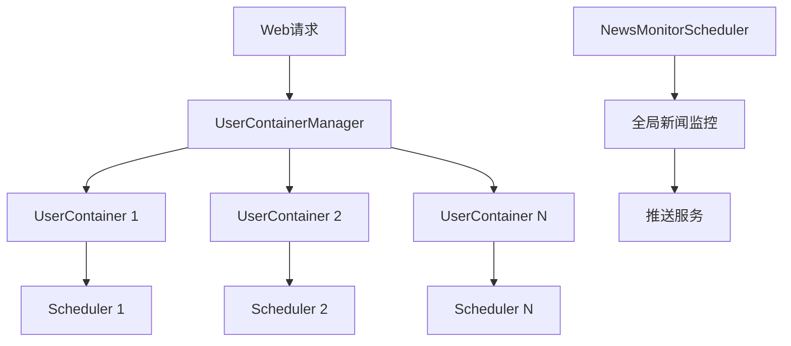

[根目录](../../CLAUDE.md) > [src](../) > **core**

# Core 模块 - 核心功能层

## 📋 模块职责

提供核心业务功能，包括用户容器管理和新闻监控调度器。

## 🏗️ 核心功能

### 1. 用户容器管理 (`user_container.py`)

**职责**：多用户隔离与资源管理

**核心类**：
```python
class UserContainer:
    """单用户容器，隔离每个用户的资源"""
    def __init__(self, session_id: str):
        self.session_id = session_id
        self.scheduler_instance = None  # Scheduler实例
        self.lock = threading.Lock()     # 线程锁
        self.last_activity = datetime.now()

class UserContainerManager:
    """用户容器管理器，管理所有用户容器"""
    def get_or_create(self, session_id: str) -> UserContainer:
        """获取或创建用户容器"""

    def cleanup_inactive_users(self, inactive_minutes: int = 30):
        """清理不活跃用户"""
```

**使用方法**：
```python
from src.core.user_container import get_container_manager

# 获取容器管理器
manager = get_container_manager()

# 获取或创建用户容器
container = manager.get_or_create(session_id='user123')

# 访问用户的Scheduler
scheduler = container.scheduler_instance
```

**功能特性**：
- ✅ 多用户资源隔离
- ✅ 自动清理不活跃用户
- ✅ 线程安全（使用锁）
- ✅ 懒加载（按需创建Scheduler）

### 2. 新闻监控调度器 (`news_monitor_scheduler.py`)

**职责**：全局新闻监控任务调度

**核心功能**：
- ✅ 定期获取市场新闻
- ✅ 监控重要公告
- ✅ 新闻情绪分析
- ✅ 推送重要新闻

**使用方法**：
```python
from src.core.news_monitor_scheduler import NewsMonitorScheduler

# 创建调度器
scheduler = NewsMonitorScheduler()

# 启动监控
scheduler.start()

# 停止监控
scheduler.stop()
```

## 🔗 数据流



## 📁 相关文件

- `src/core/user_container.py` - 用户容器管理
- `src/core/news_monitor_scheduler.py` - 新闻监控调度器

---

**维护者**: AI Architect
**模块状态**: ✅ 用户容器和新闻监控完整实现
**最后更新**: 2025-11-22 14:32:44
**依赖模块**: [database](../database/CLAUDE.md), [tools](../tools/CLAUDE.md), [utils](../utils/CLAUDE.md)
