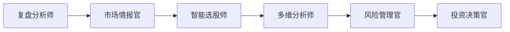
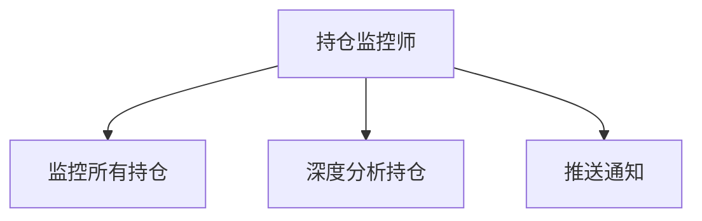
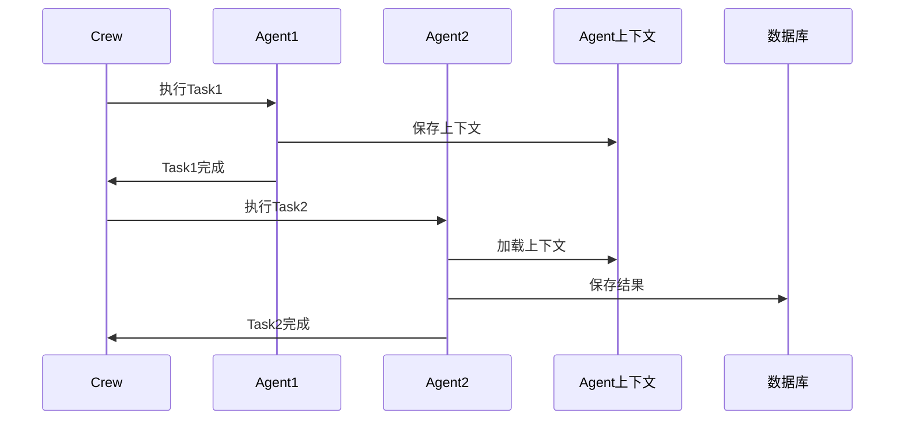

[根目录](../../CLAUDE.md) > [src](../) > **crews**

# Crews 模块 - CrewAI 配置层

## 📋 模块职责

定义和管理 CrewAI Crew 配置，协调多个 Agent 协作完成复杂任务。包含 3 个 Crew：智能推荐、股票评估、持仓监控。

## 🤝 3 个 Crew 详解

### 1. 智能推荐 Crew (`smart_recommendation_crew.py`)

**职责**：协调 6 个 Agent 完成股票推荐

**Agent 序列**：


**Task 序列**：
1. **复盘任务**：分析昨日表现 + 策略胜率 + 经验总结
2. **情报任务**：市场环境分析 + 新闻热点 + 策略推荐
3. **选股任务**：动态筛选 + 质量评估 + 候选股票池
4. **分析任务**：5维深度分析（技术+资金+基本面+新闻+社区）
5. **风险任务**：风险评估 + 高风险股票剔除
6. **决策任务**：综合评分 + Top N 选择 + 推送通知

**创建方法**：
```python
from src.crews.smart_recommendation_crew import create_smart_recommendation_crew

# 创建Crew
crew = create_smart_recommendation_crew(session_id='user123')

# 执行Crew
result = crew.kickoff()
```

**特性**：
- ✅ 支持多用户隔离
- ✅ Agent上下文传递
- ✅ 流式输出支持
- ✅ 错误处理机制

### 2. 股票评估 Crew (`stock_evaluation_crew.py`)

**职责**：评估指定股票的投资价值

**Agent 序列**：


**Task 序列**：
1. **技术分析**：MACD、KDJ、RSI、支撑/压力位
2. **基本面分析**：PE、PB、ROE、营收增长
3. **新闻分析**：近期新闻情绪
4. **综合评估**：给出投资建议和评分

**创建方法**：
```python
from src.crews.stock_evaluation_crew import create_stock_evaluation_crew

# 创建Crew
crew = create_stock_evaluation_crew(
    stock_codes=['000001', '600000'],
    session_id='user123'
)

# 执行Crew
result = crew.kickoff()
```

### 3. 持仓监控 Crew (`position_monitor_crew.py`)

**职责**：实时监控持仓，智能卖点判断

**Agent 序列**：


**Task 序列**：
1. **监控任务**：查询所有holding持仓 + 识别需要分析的持仓
2. **分析任务**：五档盘口 + 当天逐笔数据 + 技术指标 + 卖点建议
3. **推送任务**：强烈建议卖出/建议卖出 → 立即推送

**创建方法**：
```python
from src.crews.position_monitor_crew import create_position_monitor_crew

# 创建Crew
crew = create_position_monitor_crew(session_id='user123')

# 执行Crew
result = crew.kickoff()
```

**特性**：
- ✅ 5分钟级别监控
- ✅ 智能卖点判断
- ✅ 移动止盈管理
- ✅ 实时推送通知

## 🚀 Crew 执行方式

### 1. 同步执行

```python
from src.crews.smart_recommendation_crew import create_smart_recommendation_crew

crew = create_smart_recommendation_crew(session_id='user123')
result = crew.kickoff()
print(result)
```

### 2. 流式执行（推荐）

```python
from src.api.crew_stream_api import crew_stream_api
from flask import Flask

app = Flask(__name__)
app.register_blueprint(crew_stream_api)

# 前端通过 /api/crew/recommend/stream 访问
# 实时获取Agent执行过程
```

## 🔗 数据流



## 📁 相关文件

- `src/crews/smart_recommendation_crew.py` - 智能推荐Crew
- `src/crews/stock_evaluation_crew.py` - 股票评估Crew
- `src/crews/position_monitor_crew.py` - 持仓监控Crew

---

**维护者**: AI Architect
**模块状态**: ✅ 3个Crew完整实现
**最后更新**: 2025-11-22 14:32:44
**Crew数量**: 3个
**依赖模块**: [agents](../agents/CLAUDE.md), [database](../database/CLAUDE.md)
