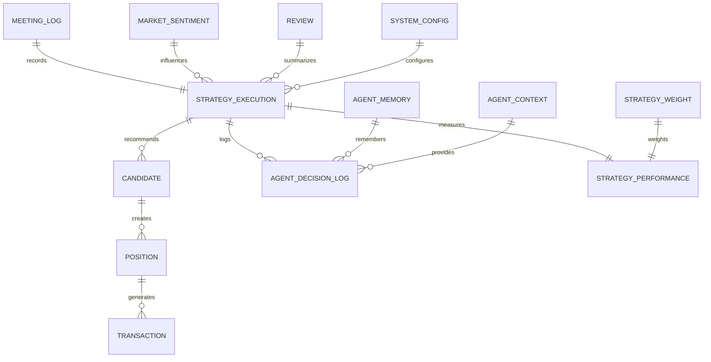
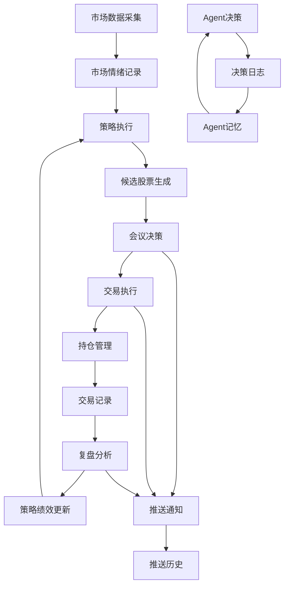

[根目录](../../../CLAUDE.md) > [src](../../) > **database**

# Database 模块 - 数据存储层

## 📋 模块职责

负责完整的数据持久化解决方案，包含14张ORM模型表，支持候选股票、持仓管理、交易记录、会议日志、策略绩���等全业务流程。

## 🗄️ 数据库架构

### 数据库引擎
- **类型**: SQLite 3
- **路径**: `data/stock_trading.db`
- **特性**: ACID事务支持、自动备份、版本兼容
- **连接池**: SQLAlchemy ORM + Session管理

### 14张ORM模型表



## 📊 核心数据表详解

### 1. 📋 candidates - 候选股票池
**用途**: 存储系统推荐的候选股票
**关键字段**:
```sql
stock_code VARCHAR(10)     -- 股票代码
stock_name VARCHAR(50)     -- 股票名称
strategy_name VARCHAR(50)  -- 使用策略
final_score DECIMAL(5,2)   -- 综合评分
ceo_decision VARCHAR(20)   -- CEO决策 (STRONG_BUY/BUY/HOLD/PASS)
cro_approved BOOLEAN       -- CRO是否批准
recommend_track VARCHAR(20) -- 推荐渠道 (track1_tail/track2_next)
can_sell_date DATE        -- T+1可卖日期
```

### 2. 💼 positions - 持仓管理
**用途**: 跟踪当前持仓状态
**关键字段**:
```sql
stock_code VARCHAR(10)     -- 股票代码
buy_date DATE             -- 买入日期
buy_price DECIMAL(10,2)   -- 买入价格
quantity INTEGER          -- 持仓数量
can_sell_date DATE        -- 最早可卖日期 (T+1约束)
strategy_used VARCHAR(50)  -- 使用策略
current_price DECIMAL(10,2) -- 当前价格
profit_loss DECIMAL(15,2)  -- 浮动盈亏
status VARCHAR(20)         -- 持仓状态 (holding/sold)
position_pct DECIMAL(5,2)  -- 仓位占比
```

### 3. 💰 transactions - 交易记录
**用途**: 记录所有买卖操作
**关键字段**:
```sql
stock_code VARCHAR(10)     -- 股票代码
trade_type VARCHAR(10)     -- 交易类型 (BUY/SELL)
trade_date DATE           -- 交易日期
price DECIMAL(10,2)       -- 交易价格
quantity INTEGER          -- 交易数量
amount DECIMAL(15,2)      -- 交易金额
profit_loss DECIMAL(15,2)  -- 盈亏 (仅SELL类型)
strategy_used VARCHAR(50)  -- 使用策略
position_id INTEGER       -- 关联持仓ID
```

### 4. 📝 reviews - 复盘记录
**用途**: 每日盘后复盘数据
**关键字段**:
```sql
review_date DATE           -- 复盘日期 (唯一)
total_trades INTEGER       -- 总交易数
win_trades INTEGER         -- 盈利交易数
win_rate DECIMAL(5,2)     -- 胜率
total_profit_loss DECIMAL(15,2) -- 总盈亏
strategy_performance JSON  -- 策略表现
next_day_recommendations JSON -- 次日推荐
```

### 5. 🧠 agent_memory - Agent记忆
**用途**: 记录Agent历史决策和学习
**关键字段**:
```sql
agent_name VARCHAR(50)     -- Agent名称
memory_date DATE          -- 记忆日期
memory_type VARCHAR(50)   -- 记忆类型 (decision/learning/reflection)
memory_content TEXT       -- 记忆内容
stock_code VARCHAR(10)    -- 关联股票
decision_result VARCHAR(20) -- 决策结果
```

### 6. 📈 market_sentiment - 市场情绪
**用途**: 每日市场状态记录
**关键字段**:
```sql
sentiment_date DATE        -- 记录日期 (唯一)
market_state VARCHAR(20)  -- 市场状态 (hot/warm/neutral/cold/panic)
sentiment_score DECIMAL(5,2) -- 情绪评分
limit_up_count INTEGER    -- 涨停家数
limit_down_count INTEGER  -- 跌停家数
hot_topics JSON          -- 热点题材
```

### 7. ⚙️ system_config - 系统配置
**用途**: 动态系统参数
**关键字段**:
```sql
config_key VARCHAR(100)    -- 配置键 (唯一)
config_value TEXT         -- 配置值
config_type VARCHAR(20)   -- 配置类型 (string/int/float/bool/json)
description TEXT         -- 配置描述
```

### 8. 🎯 strategy_executions - 策略执行记录
**用途**: 记录每日策略执行情况
**关键字段**:
```sql
execution_date DATE       -- 执行日期
market_state VARCHAR(20)  -- 市场状态
primary_strategy VARCHAR(50) -- 主策略
secondary_strategy VARCHAR(50) -- 辅策略
primary_weight DECIMAL(3,2) -- 主策略权重
recommended_stocks JSON   -- 推荐股票列表
execution_result VARCHAR(20) -- 执行结果
```

### 9. 📊 strategy_performance - 策略绩效
**用途**: 策略表现统计
**关键字段**:
```sql
strategy_name VARCHAR(50) -- 策略名称
period_start DATE         -- 统计周期开始
period_end DATE          -- 统计周期结束
total_trades INTEGER      -- ���交易数
win_rate DECIMAL(5,2)    -- 胜率
total_return DECIMAL(10,2) -- 总收益
sharpe_ratio DECIMAL(5,2) -- 夏普比率
current_weight DECIMAL(3,2) -- 当前权重
```

### 10. ⚖️ strategy_weights - 策略权重
**用途**: 策略权重自进化管理
**关键字段**:
```sql
strategy_name VARCHAR(50) -- 策略名称
current_weight DECIMAL(3,2) -- 当前权重
previous_weight DECIMAL(3,2) -- 上期权重
rolling_30d_win_rate DECIMAL(5,2) -- 30日胜率
rolling_30d_return_pct DECIMAL(5,2) -- 30日收益率
is_enabled BOOLEAN        -- 是否启用
last_review_date DATE    -- 最后审查日期
```

### 11. 📝 agent_decision_logs - Agent决策日志
**用途**: 详细记录每个Agent的决策过程
**关键字段**:
```sql
agent_name VARCHAR(50)    -- Agent名称
decision_time DATETIME    -- 决策时间
stock_code VARCHAR(10)    -- 关联股票
decision_type VARCHAR(20) -- 决策类型
decision_content TEXT     -- 决策内容
score DECIMAL(5,2)       -- 评分
confidence DECIMAL(3,2)   -- 置信度
```

### 12. 🤝 meeting_logs - 会议日志
**用途**: 记录各种会议的详细过程
**关键字段**:
```sql
meeting_type VARCHAR(20)  -- 会议类型 (morning/emergency/evening)
meeting_date DATE         -- 会议日期
participants VARCHAR(200) -- 参与者
meeting_transcript TEXT   -- 完整会议记录
decisions JSON           -- 会议决策 (JSON格式)
```

### 13. 📊 stock_concepts - 股票概念板块
**用途**: 存储股票的概念板块标签
**关键字段**:
```sql
stock_code VARCHAR(10)   -- 股票代码
tag VARCHAR(100)         -- 概念标签
category VARCHAR(50)     -- 所属板块/概念/行业
weight FLOAT            -- 权重
```

### 14. 🔄 agent_context - Agent上下文
**用途**: Agent间数据传递和上下文共享
**关键字段**:
```sql
context_type VARCHAR(50)  -- 上下文类型 (recommended_count/strategy_name/candidate_stocks等)
context_data JSON        -- 上下文数据 (JSON格式)
created_at DATETIME      -- 创建时间
```

## 🚀 入口与启动

### 数据库初始化
```bash
# 创建所有表 (14张ORM模型表)
python -m src.database.init_db

# 检查表结构
python -m src.database.init_db --check

# 重建数据库 (⚠️ 会删除所有数据)
python -m src.database.init_db --drop
```

### 数据库连接
```python
from src.database.db_manager import get_db
from src.database.models import Candidate, Position, Transaction

# 获取数据库会话
db = get_db()

# 使用会话操作
with db.get_session() as session:
    # 查询候选股票
    candidates = session.query(Candidate).filter(
        Candidate.recommend_time >= datetime.now() - timedelta(days=1)
    ).all()

    # 创建新记录
    new_candidate = Candidate(
        stock_code="000001",
        stock_name="平安银行",
        strategy_name="龙头战法",
        final_score=88.5,
        ceo_decision="STRONG_BUY"
    )
    session.add(new_candidate)
    session.commit()
```

### ORM模型使用
```python
from src.database.models import (
    Candidate, Position, Transaction, Review,
    AgentMemory, MarketSentiment, SystemConfig,
    StrategyExecution, StrategyPerformance, StrategyWeight,
    AgentDecisionLog, MeetingLog, StockConcepts, AgentContext
)

# 创建候选股票记录
candidate = Candidate(
    stock_code="000001",
    stock_name="平安银行",
    recommend_time=datetime.now(),
    recommend_track="track1_tail",
    strategy_name="龙头战法",
    final_score=88.5,
    cto_score=85,
    cfo_score=90,
    cmo_score=88,
    cso_score=90,
    ceo_decision="STRONG_BUY",
    ceo_reason="技术面优秀,资金面强劲",
    cro_approved=True,
    cro_risk_level="low",
    recommend_price=15.20
)

# 创建持仓记录
position = Position(
    stock_code="000001",
    stock_name="平安银行",
    buy_date=date.today(),
    buy_price=15.20,
    quantity=1000,
    buy_amount=15200.0,
    can_sell_date=date.today() + timedelta(days=1),
    strategy_used="龙头战法",
    position_pct=0.15
)
```

## 🔗 对外接口

### 数据库管理器接口
```python
class DatabaseManager:
    def get_session(self) -> Session:
        """获取数据库会话"""

    def execute_query(self, query: str, params: dict = None) -> List:
        """执行原生SQL查询"""

    def backup_database(self, backup_path: str = None):
        """备份数据库"""

    def get_table_info(self, table_name: str) -> Dict:
        """获取表结构信息"""
```

### 数据查询示例
```python
from src.database.db_manager import get_db

db = get_db()

# 1. 查询今日推荐股票
with db.get_session() as session:
    today_candidates = session.query(Candidate).filter(
        func.date(Candidate.recommend_time) == date.today()
    ).order_by(Candidate.final_score.desc()).limit(10).all()

# 2. 查询当前持仓
with db.get_session() as session:
    current_positions = session.query(Position).filter(
        Position.status == 'holding'
    ).all()

# 3. 统计交易表现
with db.get_session() as session:
    monthly_stats = session.query(
        func.count(Transaction.id).label('total_trades'),
        func.sum(Transaction.profit_loss).label('total_pnl'),
        func.avg(Transaction.profit_loss).label('avg_pnl')
    ).filter(
        Transaction.trade_date >= date.today() - timedelta(days=30)
    ).first()
```

## 🔧 关键依赖与配置

### 核心依赖
```python
# SQLAlchemy ORM
sqlalchemy>=2.0.0
alembic>=1.12.0

# 数据处理
pandas>=2.2.0
numpy>=2.0.0

# 日期时间
python-dateutil>=2.8.0
pytz>=2024.1
```

### 环境配置
```python
# .env 配置
DATABASE_PATH=data/stock_trading.db
DATABASE_BACKUP_INTERVAL=86400  # 24小时备份一次
DATABASE_VACUUM_INTERVAL=604800  # 一周清理一次
```

### 数据库配置 (config/settings.yaml)
```yaml
database:
  path: "data/stock_trading.db"
  backup_interval_seconds: 86400  # 每日备份
  vacuum_interval_seconds: 604800  # 每周清理
```

## 📊 数据流与关系

### 业务数据流


### 表关系说明
1. **candidates → positions**: 候选股票被买入后转为持仓
2. **positions → transactions**: 持仓的买卖操作生成交易记录
3. **strategy_executions → candidates**: 策略执行生成候选股票推荐
4. **reviews → strategy_executions**: 复盘总结策略执行效果
5. **market_sentiment → strategy_executions**: 市场情绪影响策略选择

## 🧪 测试与质量

### 数据库测试
```python
# tests/test_database_models.py
def test_candidate_creation():
    """测试候选股票创建"""

def test_position_lifecycle():
    """测试持仓完整生命周期"""

def test_transaction_integrity():
    """测试交易数据完整性"""

# tests/test_db_manager.py
def test_session_management():
    """测试会话管理"""

def test_query_performance():
    """测试查询性能"""

def test_backup_restore():
    """测试备份恢复"""
```

### 数据质量检查
1. **主键约束**: 确保每条记录唯一性
2. **外键关系**: 保证数据关联完整性
3. **索引优化**: 提高查询性能
4. **数据类型**: 确保数据格式正确
5. **约束检查**: 业务逻辑约束

## ⚠️ 常见问题 (FAQ)

### Q1: 如何处理T+1约束？
A1: positions表中的can_sell_date字段自动计算T+1日期，交易系统会检查此字段防止违规卖出。

### Q2: 数据库如何备份？
A1: 系统每日自动备份到data/backups/目录，也可手动调用db_manager.backup_database()。

### Q3: 如何优化查询性能？
A1: 关键字段已建立索引，复合查询使用复合索引，定期执行VACUUM清理碎片。

### Q4: 如何进行数据迁移？
A1: 使用Alembic进行版本控制，可安全升级数据库结构而不丢失数据。

### Q5: 如何处理并发访问？
A1: SQLAlchemy自动处理连接池和事务隔离，确保多进程并发安全。

## 📁 相关文件清单

### 核心文件
- `src/database/models.py` ✅ **已读取前100行** (470行) - ORM模型定义 (13张表)
- `src/database/init_db.py` ✅ **已读取** (297行) - 数据库初始化脚本
- `src/database/db_manager.py` - 数据库管理器
- `src/database/migrations/` - 数据库迁移脚本

### 配置文件
- `config/settings.yaml` - 数据库配置
- `.env` - 环境变量配置

### 测试文件
- `tests/test_database_models.py` - 模型测试
- `tests/test_db_manager.py` - 管理器测试
- `tests/test_migrations.py` - 迁移测试

### 数据文件
- `data/stock_trading.db` - 主数据库文件
- `data/backups/` - 自动备份目录

---

**维护者**: AI Architect
**模块状态**: ✅ 13张表完整实现
**最后更新**: 2025-10-29 15:12:59
**数据规模**: 13张表，支持完整业务流程
**依赖模块**: [agents](../agents/CLAUDE.md), [strategies](../strategies/CLAUDE.md), [meetings](../meetings/CLAUDE.md)