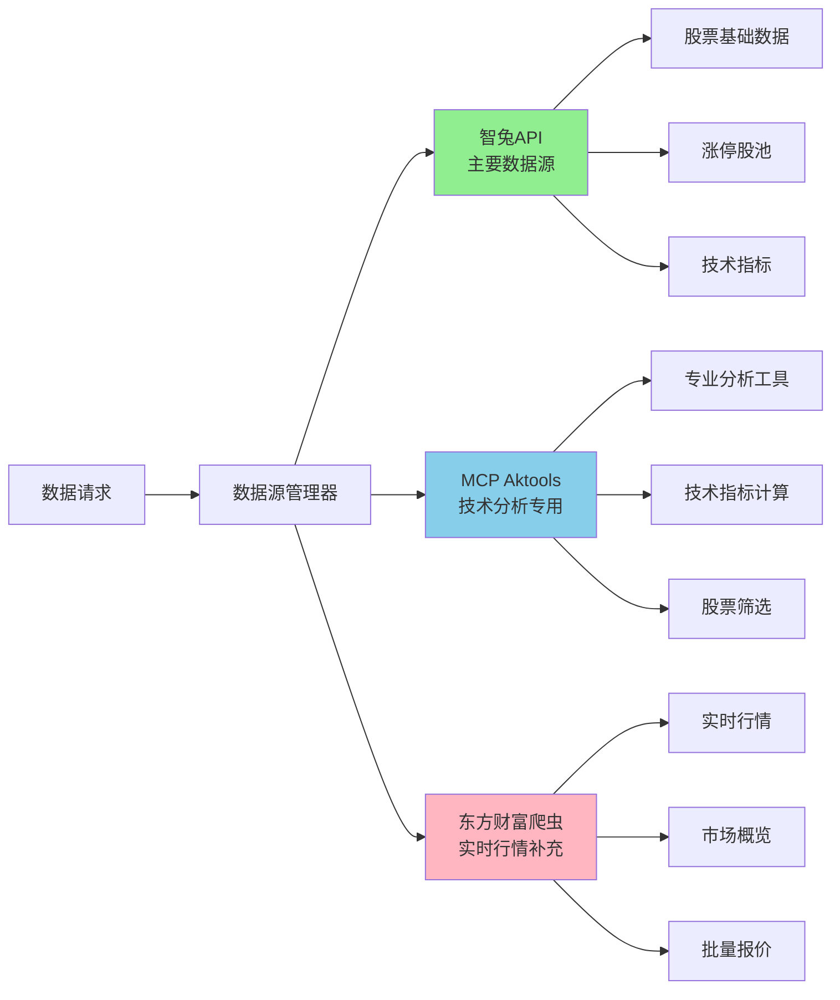
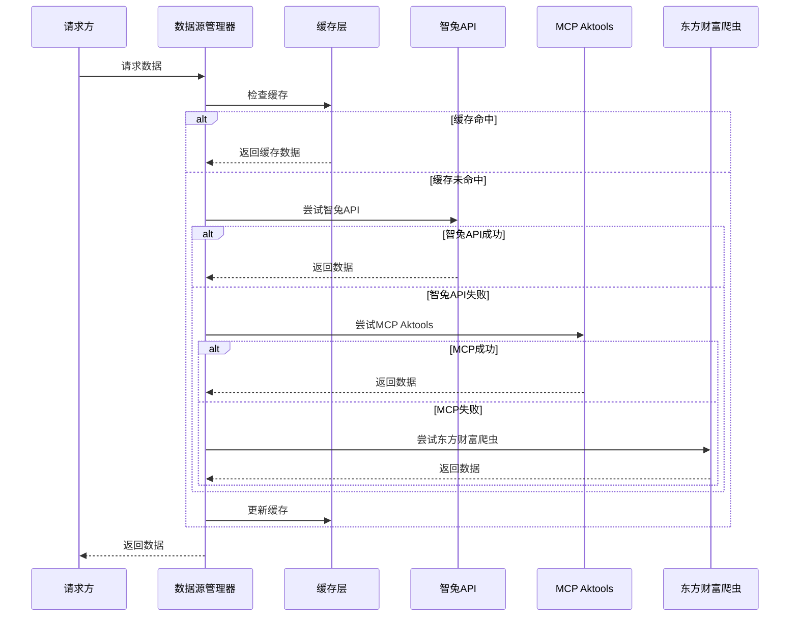

[根目录](../../../CLAUDE.md) > [src](../../) > **tools**

# Tools 模块 - 数据源集成层

## 📋 模块职责

负责集成多个数据源，提供统一的数据获取接口，实现数据源的智能选择、容错机制和负载均衡策略。

## 🔗 数据源架构

### 三重数据源保障



## 📊 核心数据源详解

### 1. 🥇 智兔API (主要数据源)

**特性**：
- **套餐**: 包年版 (3000次/分钟)
- **稳定性**: 高，API接口稳定可靠
- **数据质量**: 优秀，字段丰富完整
- **适用场景**: 基础数据、股池数据、历史数据

**核心接口**：
```python
# 股票列表
GET /hs/list/all?token={token}

# 涨停股池
GET /hs/pool/ztgc/{trade_date}?token={token}

# 实时行情
GET /hs/real/ssjy/{stock_code}?token={token}

# 历史数据
GET /hs/history/{symbol}/{timeframe}/{adjust}?token={token}

# 技术指标
GET /hs/history/macd/{symbol}/{timeframe}/{adjust}?token={token}
```

**关键功能**：
- ✅ 股票基础信息获取
- ✅ 涨停/跌停/强势股池
- ✅ 实时交易数据
- ✅ 历史分时数据
- ✅ MACD、MA、BOLL、KDJ等技术指标
- ✅ 资金流向数据
- ✅ 自动速率限制管理

### 2. 🔧 MCP Aktools (技术分析专用)

**特性**：
- **专业性**: 技术分析工具丰富
- **异步支持**: 支持异步调用
- **深度分析**: 复杂技术指标计算
- **适用场景**: 技术指标计算、股票筛选

**核心功能**：
- ✅ 高级技术指标计算
- ✅ 股票筛选器
- ✅ 异步数据获取
- ✅ 专业分析工具

### 3. 🕷️ 东方财富爬虫 (实时行情补充)

**特性**：
- **实时性**: 行情数据更新及时
- **覆盖面**: 沪深全市场覆盖
- **代理池**: 集成IP代理防封禁
- **容错性**: 多重备用数据源

**核心功能**：
```python
# 单股行情
crawler.get_stock_quote(stock_code)

# 批量行情
crawler.crawl_multiple_stocks(stock_codes)

# 市场概览
crawler.get_market_overview(market='all')

# 历史行情查询
crawler.query_quotes(stock_code, start_date, end_date)
```

**智能代理管理**：
- 🔄 巨量IP代理池自动轮换
- ⚡ 并发控制和速率限制
- 🛡️ 反爬虫检测规避
- 📊 数据库自动存储

### 4. 📰 Tavily新闻API (市场情绪)

**特性**：
- **实时性**: 新闻搜索实时更新
- **情绪分析**: 内置情绪分析功能
- **热点提取**: 自动识别市场热点
- **适用场景**: CMO情绪分析、新闻驱动策略

**核心工具**：
- ✅ 新闻搜索 (NewsSearchTool)
- ✅ 热点提取 (HotTopicExtractorTool)
- ✅ 突发新闻监控 (BreakingNewsTool)
- ✅ 情绪分析 (基于关键词)

## 🎯 数据源管理器 (DataSourceManager)

### 智能选择策略

```python
# 数据源优先级配置
strategies = {
    'stock_info': {
        'primary': DataSource.ZHITU,           # 主要使用智兔API
        'fallback': [DataSource.MCP, DataSource.EASTMONEY]  # 备用数据源
    },
    'realtime_quote': {
        'primary': DataSource.ZHITU,           # 智兔API优先
        'fallback': [DataSource.EASTMONEY, DataSource.MCP]
    },
    'technical_indicators': {
        'primary': DataSource.MCP,             # MCP优先（专业）
        'fallback': [DataSource.ZHITU, DataSource.EASTMONEY]
    }
}
```

### 核心特性

1. **自动故障转移**：主数据源失败时自动切换备用数据源
2. **缓存机制**：5分钟TTL缓存，提高响应速度
3. **性能监控**：实时监控各数据源响应时间和成功率
4. **负载均衡**：智能分配请求负载
5. **统一接口**：对外提供统一的数据获取接口

### 使用示例

```python
from src.tools.data_source_manager import create_data_manager

# 创建管理器
manager = create_data_manager()

# 获取股票信息
response = await manager.get_stock_info('600000')
if response.success:
    print(f"数据源: {response.source.value}")
    print(f"数据: {response.data}")

# 获取实时行情
quote_response = await manager.get_realtime_quote('000001')

# 获取涨停股票
limit_up_response = await manager.get_limit_up_stocks()

# 查看管理器状态
status = manager.get_status()
print(f"成功率: {status['statistics']['success_rate']}%")
```

## 🚀 入口与启动

### 智兔API客户端

```python
from src.tools.zhitu_api import create_zhitu_client

# 创建客户端
client = create_zhitu_client()

# 获取股票列表
stocks = client.get_stock_list()

# 获取涨停股池
limit_up_stocks = client.get_limit_up_pool('2025-10-31')

# 获取实时数据
real_time_data = client.get_real_time_public('600000')

# 获取技术指标
macd_data = client.get_history_macd('000001.SZ')
```

### 东方财富爬虫

```python
from src.tools.eastmoney_crawler import create_eastmoney_crawler

# 创建爬虫实例
crawler = create_eastmoney_crawler(enable_proxy=False)

# 爬取单只股票
result = crawler.crawl_single_stock('600000')

# 批量爬取
results = crawler.crawl_multiple_stocks(['600000', '000001'])

# 获取市场概览
overview = crawler.get_market_overview()
```

### Tavily新闻工具

```python
from src.tools.tavily_api import get_tavily_client

# 获取客户端
client = get_tavily_client()

# 搜索新闻
news = client.search_news('人工智能政策', max_results=5)

# 提取热点话题
hot_topics = client.get_hot_topics()

# 获取突发新闻
breaking_news = client.get_breaking_news()
```

## 🔧 关键依赖与配置

### 核心依赖

```python
# HTTP请求
requests>=2.31.0
httpx>=0.27.0

# 数据处理
pandas>=2.2.0
numpy>=2.0.0

# 异步支持
asyncio
concurrent.futures

# 时间处理
python-dateutil>=2.8.0
pytz>=2024.1

# AI框架
crewai>=0.95.0
pydantic>=2.5.0
```

### 环境配置

```bash
# 智兔API配置
ZHITU_API_BASE_URL=https://api.zhituapi.cn
ZHITU_API_TOKEN=your_zhitu_token_here

# Tavily API配置
TAVILY_API_KEY=your_tavily_key_here

# 数据库配置
DATABASE_PATH=data/stock_trading.db

# 代理配置 (可选)
GIANT_IP_API_URL=http://your-proxy-api.com
GIANT_IP_STATIC_PROXIES=proxy1:port,proxy2:port
CRAWLER_USE_PROXY=false
```

### 数据源配置 (data_source_config.json)

```json
{
  "sources": {
    "zhitu": {
      "enabled": true,
      "priority": 1,
      "timeout": 30,
      "max_retries": 3,
      "rate_limit": 3000
    },
    "mcp": {
      "enabled": true,
      "priority": 2,
      "timeout": 45,
      "max_retries": 2,
      "async_capable": true
    },
    "eastmoney": {
      "enabled": true,
      "priority": 3,
      "timeout": 60,
      "max_retries": 5,
      "proxy_enabled": false
    }
  },
  "fallback_enabled": true,
  "cache_enabled": true,
  "cache_ttl": 300,
  "load_balancing": "round_robin",
  "health_check_interval": 300
}
```

## 📊 数据流与关系

### 数据获取流程



### 数据质量保证

1. **数据验证**：格式校验、字段完整性检查
2. **错误处理**：自动重试、降级策略
3. **性能监控**：响应时间、成功率统计
4. **缓存策略**：智能缓存、TTL管理
5. **容错机制**：多数据源备份、故障转移

## 🧪 测试与质量

### 单元测试

```python
# tests/test_zhitu_api.py
def test_get_stock_list():
    """测试股票列表获取"""
    client = create_zhitu_client()
    stocks = client.get_stock_list()
    assert len(stocks) > 0
    assert 'stock_code' in stocks[0]

def test_get_limit_up_pool():
    """测试涨停股池获取"""
    client = create_zhitu_client()
    today = date.today().strftime('%Y-%m-%d')
    stocks = client.get_limit_up_pool(today)
    assert isinstance(stocks, list)

# tests/test_eastmoney_crawler.py
def test_crawl_single_stock():
    """测试单股爬取"""
    crawler = create_eastmoney_crawler()
    result = crawler.crawl_single_stock('600000')
    assert result.success
    assert result.data is not None

# tests/test_data_source_manager.py
def test_data_source_fallback():
    """测试数据源故障转移"""
    manager = create_data_manager()
    # 模拟主数据源失败
    response = asyncio.run(manager.get_stock_info('600000'))
    assert response.success
```

### 集成测试

```python
# tests/test_integration.py
def test_multi_source_data_consistency():
    """测试多数据源数据一致性"""
    manager = create_data_manager()

    # 从不同数据源获取相同股票数据
    zhitu_data = asyncio.run(manager.get_data('stock_info', {'stock_code': '600000'}))
    eastmoney_data = manager.eastmoney_crawler.get_stock_quote('600000')

    # 验证关键字段一致性
    assert zhitu_data.data['stock_code'] == eastmoney_data['stock_code']

def test_cache_performance():
    """测试缓存性能提升"""
    manager = create_data_manager()

    # 首次请求
    start_time = time.time()
    response1 = asyncio.run(manager.get_stock_info('600000'))
    first_duration = time.time() - start_time

    # 缓存请求
    start_time = time.time()
    response2 = asyncio.run(manager.get_stock_info('600000'))
    second_duration = time.time() - start_time

    # 缓存应该更快
    assert second_duration < first_duration
    assert response2.cached == True
```

## ⚠️ 常见问题 (FAQ)

### Q1: 如何处理API速率限制？
A1: 智兔API内置速率限制管理器，自动控制请求频率。当达到限制时会自动等待。

### Q2: 代理爬虫被封禁怎么办？
A2: 系统集成了巨量IP代理池，自动轮换IP地址。同时设置请求间隔，降低封禁风险。

### Q3: 数据源都失败了怎么办？
A3: 数据源管理器会尝试所有可用数据源，并提供详细的错误信息。建议检查网络连接和API密钥配置。

### Q4: 如何优化数据获取性能？
A4: 启用缓存机制、使用异步调用、合理设置请求间隔、优先使用响应速度快的API。

### Q5: 如何添加新的数据源？
A5: 继承基础数据源接口，实现必要的方法，然后��数据源管理器中注册新的数据源。

## 📁 相关文件清单

### 核心文件
- `src/tools/zhitu_api.py` ✅ **已读取** (1024行) - 智兔API完整封装
- `src/tools/eastmoney_crawler.py` ✅ **已读取** (1119行) - 东方财富爬虫工具
- `src/tools/tavily_api.py` ✅ **已读取** (555行) - Tavily新闻API封装
- `src/tools/data_source_manager.py` ✅ **已读取** (643行) - 数据源统一管理器
- `src/tools/mcp_client.py` - MCP Aktools客户端 (未完整读取)

### 配置文件
- `src/tools/crawler_config.json` - 爬虫配置文件
- `src/tools/data_source_config.json` - 数据源配置文件

### 测试文件
- `tests/test_zhitu_api.py` - 智兔API测试
- `tests/test_eastmoney_crawler.py` - 爬虫测试
- `tests/test_data_source_manager.py` - 数据源管理器测试
- `tests/test_integration.py` - 集成测试

### 工具文件
- `zhituapi.md` ✅ **已读取** - 智兔API文档

---

**维护者**: AI Architect
**模块状态**: ✅ 核心数据源完整实现
**最后更新**: 2025-10-31 13:43:49
**数据源**: 4个主要数据源（智兔API + MCP + 东方财富 + Tavily）
**缓存策略**: 5分钟TTL，智能缓存管理
**容错机制**: 三重数据源保障，自动故障转移
**依赖模块**: [database](../database/CLAUDE.md)