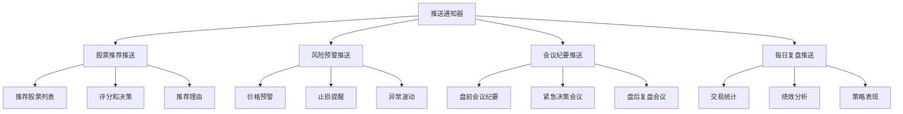
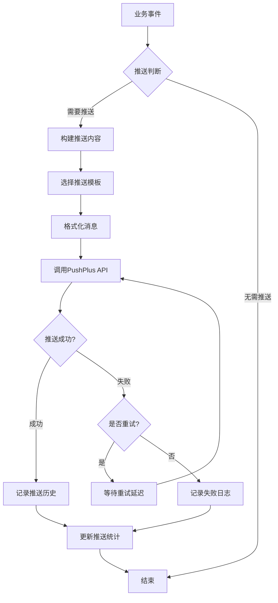
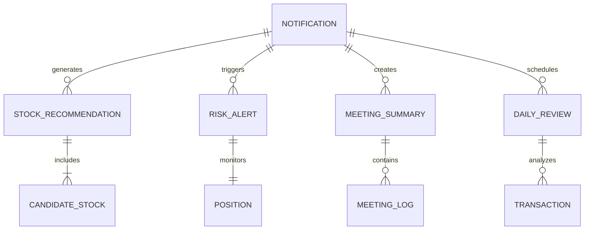

[根目录](../../../CLAUDE.md) > [src](../../) > **utils**

# Utils 模块 - 通用工具层

## 📋 模块职责

提供系统通用工具和辅助功能，包括推送通知、辅助函数、配置管理等，为整个交易系统提供基础支撑服务。

## 🔧 核心组件

### 1. 📅 交易日历工具 (trading_calendar.py)

#### 功能特性

- **交易日判断**: 判断指定日期是否是交易日
- **日期调整**: 自动调整非交易日到最近的交易日
- **交易日查找**: 向前/向后查找最近的交易日
- **简化实现**: 周一到周五是交易日（TODO: 接入交易日历API）

#### 核心函数

```python
from src.utils.trading_calendar import (
    is_trading_day,
    get_last_trading_day,
    get_next_trading_day,
    adjust_to_trading_day
)

# 判断是否交易日
from datetime import date
is_trading = is_trading_day(date(2025, 11, 16))  # False (周六)

# 获取最近的交易日（向前回溯）
last_trading_day = get_last_trading_day(days_back=1)  # 昨天（如果是交易日）

# 获取下一个交易日（向后查找）
next_trading_day = get_next_trading_day(from_date=date(2025, 11, 16))  # 周一

# 调整到最近的交易日
adjusted_date = adjust_to_trading_day(date(2025, 11, 16), direction='backward')  # 周五
adjusted_date = adjust_to_trading_day(date(2025, 11, 16), direction='forward')   # 周一
```

#### 使用场景

- **K线数据获取**: 过滤非交易日，避免无效API请求
- **推荐时间调整**: 将周末推荐调整到最近的交易日
- **回测日期生成**: 生成交易日序列，排除周末和节假日
- **监控任务调度**: 根据交易日调整监控频率

#### 实现逻辑

```python
def is_trading_day(check_date: date) -> bool:
    """
    判断是否交易日

    简化版：周一到周五（weekday < 5）是交易日
    TODO: 接入交易日历API，准确判断节假日
    """
    return check_date.weekday() < 5
```

#### 未来优化

- **接入交易日历API**: 准确判断节假日（国庆、春节等）
- **缓存机制**: 缓存交易日判断结果，减少重复计算
- **多市场支持**: 支持A股、港股、美股等不同市场的交易日历

### 2. 📱 PushPlus 微信推送通知器

#### 功能特性

- **实时推送**: 微信公众号即时消息推送
- **富文本支持**: HTML、Markdown、JSON格式
- **模板丰富**: 股票推荐、风险预警、会议纪要等模板
- **群组支持**: 支持群组推送，可多人接收

#### 推送类型



#### 使用示例

```python
from src.utils.pushplus_notifier import (
    send_stock_recommendation,
    send_risk_alert,
    send_meeting_summary,
    send_daily_review
)

# 推送股票推荐
candidates = [
    {
        "stock_code": "000001",
        "stock_name": "平安银行",
        "final_score": 85.5,
        "ceo_decision": "买入",
        "position_size": "10%",
        "reasoning": "技术面强势，资金流入明显"
    }
]
send_stock_recommendation(candidates)

# 推送风险预警
alert_data = {
    "stock_code": "000001",
    "stock_name": "平安银行",
    "current_price": 15.20,
    "buy_price": 16.00,
    "profit_loss_pct": -5.0,
    "alert_type": "止损预警",
    "message": "跌破止损线",
    "suggestion": "建议立即卖出"
}
send_risk_alert(alert_data)

# 推送会议纪要
meeting_log = [
    {
        "time": "09:00:00",
        "speaker": "CMO",
        "message": "今日市场情绪偏暖，科技板块表现活跃"
    }
]
send_meeting_summary(meeting_log, "盘前策略会议")
```

#### 推送模板展示

**股票推荐模板**：
```html
<h2>📈 今日股票推荐</h2>
<p><strong>推送时间:</strong> 2025-10-31 13:43:49</p>
<table border="1" cellpadding="5" cellspacing="0" style="border-collapse: collapse; width: 100%;">
    <tr style="background-color: #f0f0f0;">
        <th>股票</th>
        <th>评分</th>
        <th>决策</th>
        <th>仓位</th>
    </tr>
    <tr>
        <td><strong>平安银行</strong> (000001)</td>
        <td>85.5分</td>
        <td style="color: green;"><strong>买入</strong></td>
        <td>10%</td>
    </tr>
</table>
```

**风险预警模板**：
```html
<h2>⚠️ 风险预警</h2>
<p><strong>股票:</strong> 平安银行 (000001)</p>
<p><strong>当前价:</strong> 15.20元</p>
<p><strong>买入价:</strong> 16.00元</p>
<p><strong>盈亏:</strong> <span style="color: red;"><strong>-5.00%</strong></span></p>
<p><strong>预警原因:</strong> 跌破止损线</p>
<p><strong>建议操作:</strong> <span style="color: red;"><strong>建议立即卖出</strong></span></p>
```

## 🚀 入口与启动

### 推送器初始化

```python
from src.utils.pushplus_notifier import PushPlusNotifier

# 使用环境变量初始化
notifier = PushPlusNotifier()

# 手动指定token和topic
notifier = PushPlusNotifier(
    token="your_pushplus_token",
    topic="your_group_topic"
)
```

### 基础推送

```python
# 发送普通消息
result = notifier.send_message(
    title="测试消息",
    content="这是一条测试消息",
    template="html"
)

# 检查发送结果
if result.get("code") == 200:
    print("推送成功")
else:
    print(f"推送失败: {result.get('msg')}")
```

### 高级推送功能

```python
# 股票推荐推送
candidates = [
    {
        "stock_code": "000001",
        "stock_name": "平安银行",
        "final_score": 88.5,
        "ceo_decision": "STRONG_BUY",
        "position_size": "15%",
        "reasoning": "技术突破重要阻力位，资金持续流入"
    },
    {
        "stock_code": "000002",
        "stock_name": "万科A",
        "final_score": 82.0,
        "ceo_decision": "BUY",
        "position_size": "10%",
        "reasoning": "房地产政策利好，基本面改善"
    }
]

result = notifier.send_stock_recommendation(candidates)

# 会议纪要推送
meeting_log = [
    {"time": "09:00:00", "speaker": "CEO", "message": "今日重点关注AI和新能源板块"},
    {"time": "09:05:00", "speaker": "CMO", "message": "市场情绪偏暖，成交量放大"},
    {"time": "09:10:00", "speaker": "CFO", "message": "当前仓位65%，建议控制风险"},
    {"time": "09:15:00", "speaker": "CEO", "message": "确定今日推荐3只股票，总仓位25%"}
]

result = notifier.send_meeting_summary(
    meeting_log,
    meeting_type="盘前策略会议"
)
```

## 🔧 关键依赖与配置

### 核心依赖

```python
# HTTP请求
requests>=2.31.0

# 日期时间
datetime>=5.0

# 日志
loguru>=0.7.0

# 环境变量
python-dotenv>=1.0.0
```

### 环境配置

```bash
# PushPlus推送配置
PUSHPLUS_TOKEN=your_pushplus_token_here
PUSHPLUS_TOPIC=your_group_topic_here

# 可选：备用推送服务
NOTIFICATION_SERVICE=pushplus
BACKUP_NOTIFICATION_TOKEN=backup_token
```

### 配置文件 (config/notification_config.json)

```json
{
  "pushplus": {
    "enabled": true,
    "token": "${PUSHPLUS_TOKEN}",
    "topic": "${PUSHPLUS_TOPIC}",
    "base_url": "http://www.pushplus.plus/send",
    "timeout": 10,
    "retry_count": 3,
    "retry_delay": 1
  },
  "notification_types": {
    "stock_recommendation": {
      "enabled": true,
      "template": "html",
      "max_stocks": 10,
      "include_charts": false
    },
    "risk_alert": {
      "enabled": true,
      "template": "html",
      "urgency_levels": ["high", "medium", "low"]
    },
    "meeting_summary": {
      "enabled": true,
      "template": "html",
      "max_participants": 10,
      "include_decisions": true
    },
    "daily_review": {
      "enabled": true,
      "template": "markdown",
      "include_charts": true,
      "schedule_time": "18:00"
    }
  }
}
```

## 📊 数据流与关系

### 推送流程



### 消息类型关系



## 🧪 测试与质量

### 单元测试

```python
# tests/test_pushplus_notifier.py
import pytest
from src.utils.pushplus_notifier import PushPlusNotifier

def test_notifier_initialization():
    """测试通知器初始化"""
    notifier = PushPlusNotifier(token="test_token")
    assert notifier.token == "test_token"
    assert notifier.base_url == "http://www.pushplus.plus/send"

def test_send_message():
    """测试消息发送"""
    notifier = PushPlusNotifier(token="test_token")
    result = notifier.send_message(
        title="测试标题",
        content="测试内容",
        template="txt"
    )
    assert "code" in result
    assert "msg" in result

def test_stock_recommendation_format():
    """测试股票推荐格式化"""
    notifier = PushPlusNotifier(token="test_token")
    candidates = [
        {
            "stock_code": "000001",
            "stock_name": "平安银行",
            "final_score": 85.5,
            "ceo_decision": "买入",
            "position_size": "10%",
            "reasoning": "测试理由"
        }
    ]

    result = notifier.send_stock_recommendation(candidates)
    assert result is not None

@pytest.mark.asyncio
async def test_risk_alert_content():
    """测试风险预警内容"""
    notifier = PushPlusNotifier(token="test_token")
    alert_data = {
        "stock_code": "000001",
        "stock_name": "平安银行",
        "current_price": 15.20,
        "buy_price": 16.00,
        "profit_loss_pct": -5.0,
        "alert_type": "止损预警",
        "message": "跌破止损线",
        "suggestion": "建议立即卖出"
    }

    result = notifier.send_risk_alert(alert_data)
    assert result is not None
```

### 集成测试

```python
# tests/test_notification_integration.py
def test_end_to_end_notification():
    """测试端到端推送流程"""
    from src.utils.pushplus_notifier import send_stock_recommendation

    candidates = [
        {
            "stock_code": "600000",
            "stock_name": "浦发银行",
            "final_score": 90.0,
            "ceo_decision": "STRONG_BUY",
            "position_size": "20%",
            "reasoning": "技术面突破，基本面改善"
        }
    ]

    result = send_stock_recommendation(candidates)
    assert result.get("code") == 200

def test_notification_template_validation():
    """测试推送模板验证"""
    notifier = PushPlusNotifier(token="test_token")

    # 测试空候选列表
    result = notifier.send_stock_recommendation([])
    assert result.get("code") == 400

    # 测试空会议日志
    result = notifier.send_meeting_summary([])
    assert result.get("code") == 400

    # 测试空复盘报告
    result = notifier.send_daily_review("")
    assert result.get("code") == 400
```

### 性能测试

```python
# tests/test_notification_performance.py
import time
from src.utils.pushplus_notifier import PushPlusNotifier

def test_bulk_notification_performance():
    """测试批量推送性能"""
    notifier = PushPlusNotifier(token="test_token")

    # 生成大量候选股票
    candidates = [
        {
            "stock_code": f"00000{i}",
            "stock_name": f"测试股票{i}",
            "final_score": 80.0 + i,
            "ceo_decision": "买入",
            "position_size": "5%",
            "reasoning": f"测试理由{i}"
        }
        for i in range(1, 21)  # 20只股票
    ]

    start_time = time.time()
    result = notifier.send_stock_recommendation(candidates)
    duration = time.time() - start_time

    assert result is not None
    assert duration < 5.0  # 应该在5秒内完成

    print(f"推送20只股票耗时: {duration:.2f}秒")
```

## ⚠️ 常见问题 (FAQ)

### Q1: PushPlus Token如何获取？
A1: 访问 http://www.pushplus.plus 注册账号，在个人中心获取Token。

### Q2: 推送失败如何处理？
A2: 检查Token是否正确、网络是否正常、消息内容是否合规。系统会自动重试3次。

### Q3: 如何设置群组推送？
A3: 在PushPlus网站创建群组，获取群组编码，设置为PUSHPLUS_TOPIC环境变量。

### Q4: 推送频率有限制吗？
A4: PushPlus免费版每日500条限制，付费版无限制。建议合理控制推送频率。

### Q5: 如何自定义推送模板？
A5: 可以修改PushPlusNotifier类中的模板方法，或创建新的推送方法。

### Q6: 推送消息格式支持哪些？
A6: 支持HTML、Markdown、TXT、JSON格式，推荐使用HTML获得更好的显示效果。

### Q7: 如何处理推送失败的情况？
A7: 系统会记录推送历史和失败日志，可以查看推送统计，也可以配置备用推送服务。

## 📁 相关文件清单

### 核心文件
- `src/utils/trading_calendar.py` ✅ **已实现** (152行) - 交易日历工具
- `src/utils/pushplus_notifier.py` ✅ **已读取** (361行) - PushPlus推送通知器
- `src/utils/db_cache.py` ✅ **已实现** - 数据库缓存工具
- `src/utils/update_recommendation_performance.py` ✅ **已实现** - 推荐绩效更新工具

### 配置文件
- `config/notification_config.json` - 推送服务配置
- `.env` - 环境变量配置

### 测试文件
- `tests/test_pushplus_notifier.py` - 推送器单元测试
- `tests/test_notification_integration.py` - 集成测试
- `tests/test_notification_performance.py` - 性能测试
- `tests/test_trading_calendar.py` - 交易日历测试 (待实现)

### 扩展文件
- `src/utils/notification_history.py` - 推送历史管理 (待实现)
- `src/utils/backup_notifier.py` - 备用推送服务 (待实现)

### 相关文档
- `docs/fix-kline-trading-day-filter.md` ✅ **已完成** - K线API非交易日过滤修复报告

---

**维护者**: AI Architect
**模块状态**: ✅ 核心工具功能完整实现
**最后更新**: 2025-11-17
**核心工具**: 交易日历、推送通知、数据库缓存、绩效更新
**推送服务**: PushPlus (免费版500条/日)
**支持格式**: HTML、Markdown、TXT、JSON
**推送类型**: 股票推荐、风险预警、会议纪要、每日复盘
**依赖模块**: [database](../database/CLAUDE.md), [tools](../tools/CLAUDE.md)